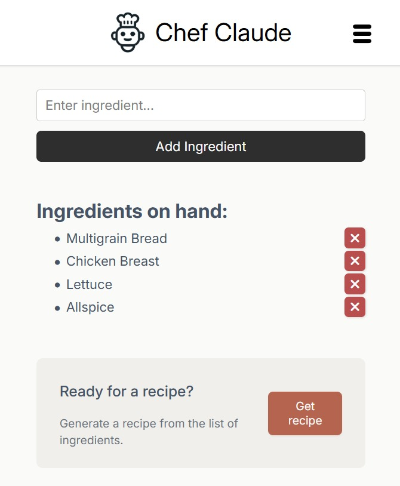
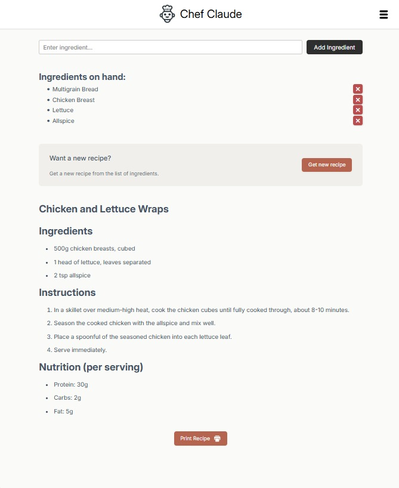

# 🍳 Chef Claude

An AI-powered recipe generator that transforms your available ingredients into delicious meal suggestions. Built with React and supports both Claude AI and Hugging Face Mistral APIs.

 


## ✨ Features

- **Smart Recipe Generation**: Enter your available ingredients and get personalized recipe suggestions
- **Ingredient Management**: Easy-to-use interface for adding and removing ingredients
- **Detailed Instructions**: Step-by-step cooking instructions with ingredient lists
- **Responsive Design**: Works seamlessly on desktop and mobile devices
- **Clean UI**: Modern, intuitive interface built with React


## 🛠️ Built With

- **React** - Frontend framework
- **Vite** - Build tool and development server
- **Claude AI / Hugging Face ** - Recipe generation (configurable)
- **CSS3** - Styling and animations
- **JavaScript ES6+** - Modern JavaScript features

## 🔧 API Configuration

This app supports both premium and free AI APIs:

### Option 1: Claude AI (Premium, Higher Quality)
- More coherent and detailed recipes
- Better ingredient understanding
- Requires paid Anthropic API access

### Option 2: Hugging Face (Free)
- Free API access
- Good recipe generation
- Perfect for learning and development

## 📦 Installation & Setup

1. **Clone the repository**
   ```bash
   git clone https://github.com/Shubhan9/chef-claude.git
   cd chef-claude
   ```

2. **Install dependencies**
   ```bash
   npm install
   ```

3. **Set up environment variables**
   Create a `.env` file in the root directory:
   
   **For Claude AI:**
   ```
   VITE_CLAUDE_API_KEY=your_claude_api_key_here
   VITE_ANTHROPIC_API_KEY=true
   ```
   
   **For Hugging Face (Free):**
   ```
   VITE_HF_ACCESS_TOKEN=your_hugging_face_token_here
   VITE_ANTHROPIC_API_KEY=false
   ```

4. **Start the development server**
   ```bash
   npm run dev
   ```

5. **Open your browser**
   Navigate to `http://localhost:5173`

## 🎯 How It Works

1. **Add Ingredients**: Type in the ingredients you have available
2. **Choose AI Provider**: The app automatically uses your configured API (Claude or Hugging Face)
3. **Generate Recipe**: Click the "Get Recipe" button
4. **Cook & Enjoy**: Follow the AI-generated recipe instructions

## 🚀 Getting Your API Keys

### Claude AI (Premium)
1. Visit [console.anthropic.com](https://console.anthropic.com)
2. Create an account and add billing
3. Generate an API key
4. Set `VITE_ANTHROPIC_API_KEY=true` in your `.env`

### Hugging Face (Free)
1. Visit [huggingface.co](https://huggingface.co)
2. Create a free account
3. Go to Settings → Access Tokens
4. Create a new token
5. Set `VITE_ANTHROPIC_API_KEY=false` in your `.env`

## 📁 Project Structure

```
chef-claude/
├── src/
│   ├── components/
│   │   ├── IngredientsList.jsx
│   │   ├── Recipe.jsx
│   │   └── ClaudeRecipe.jsx
│   ├── App.jsx
│   ├── App.css
│   └── main.jsx
├── public/
├── package.json
└── README.md
```

## 🌟 What I Learned

This project helped me master several key concepts:

- **React Hooks**: useState, useEffect for state management
- **API Integration**: Working with multiple external APIs and handling async operations
- **Conditional Logic**: Implementing API switching based on configuration
- **Component Architecture**: Building reusable, modular components
- **User Experience**: Creating intuitive interfaces for data input and display
- **Error Handling**: Managing API errors and edge cases across different providers
- **Environment Variables**: Secure API key management

## 🚧 Future Enhancements

- [ ] Save favorite recipes to local storage
- [ ] Dietary restriction filters (vegetarian, vegan, gluten-free)
- [ ] Recipe rating and review system
- [ ] Shopping list generator for missing ingredients
- [ ] Recipe sharing functionality
- [ ] Multiple cuisine style options
- [ ] Add more AI providers (OpenAI, Gemini, etc.)
- [ ] Recipe difficulty ratings
- [ ] Cooking time estimates

## 🎓 Learning Journey

Built as part of my learning journey with Scrimba's React course. While following along with tutorials, I implemented my own features and styling to make this project uniquely mine.

## 📝 Available Scripts

- `npm run dev` - Start development server
- `npm run build` - Build for production
- `npm run preview` - Preview production build
- `npm run lint` - Run ESLint

## 🤝 Contributing

Feel free to fork this project and submit pull requests for any improvements!

1. Fork the Project
2. Create your Feature Branch (`git checkout -b feature/AmazingFeature`)
3. Commit your Changes (`git commit -m 'Add some AmazingFeature'`)
4. Push to the Branch (`git push origin feature/AmazingFeature`)
5. Open a Pull Request

## 📄 License

This project is licensed under the MIT License - see the [LICENSE](LICENSE) file for details.

## 🙏 Acknowledgments

- **Scrimba** for the excellent React tutorials and learning platform
- **Anthropic** for the Claude AI API
- **Hugging Face** for free access to Mistral AI
- **Vite** team for the amazing build tool

---

**Happy Coding! 🚀**

*If you found this project helpful, please give it a ⭐!*
